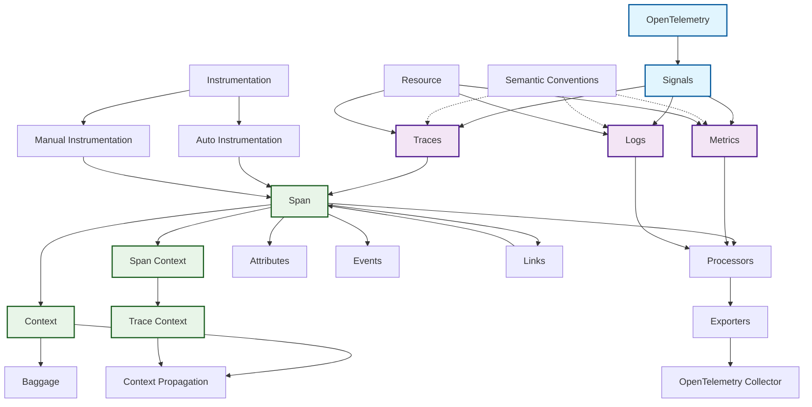

```mermaid
graph TB
    %% Core OpenTelemetry Concepts
    OTel[OpenTelemetry]
    
    %% Three Pillars of Observability
    Traces[Traces]
    Metrics[Metrics]
    Logs[Logs]
    
    %% Trace Components
    Span[Span]
    SpanContext[Span Context]
    TraceContext[Trace Context]
    
    %% Context and Propagation
    Context[Context]
    Baggage[Baggage]
    Propagation[Context Propagation]
    
    %% Signals
    Signals[Signals]
    
    %% Instrumentation
    Instrumentation[Instrumentation]
    AutoInstr[Auto Instrumentation]
    ManualInstr[Manual Instrumentation]
    
    %% Processing and Export
    Processor[Processors]
    Exporter[Exporters]
    Collector[OpenTelemetry Collector]
    
    %% Semantic Conventions
    SemanticConv[Semantic Conventions]
    
    %% Resources
    Resource[Resource]
    
    %% Relationships
    OTel --> Signals
    Signals --> Traces
    Signals --> Metrics
    Signals --> Logs
    
    %% Trace relationships
    Traces --> Span
    Span --> SpanContext
    SpanContext --> TraceContext
    Span --> Context
    
    %% Context relationships
    Context --> Baggage
    Context --> Propagation
    TraceContext --> Propagation
    
    %% Instrumentation relationships
    Instrumentation --> AutoInstr
    Instrumentation --> ManualInstr
    AutoInstr --> Span
    ManualInstr --> Span
    
    %% Processing relationships
    Span --> Processor
    Metrics --> Processor
    Logs --> Processor
    Processor --> Exporter
    Exporter --> Collector
    
    %% Semantic conventions apply to all signals
    SemanticConv -.-> Traces
    SemanticConv -.-> Metrics
    SemanticConv -.-> Logs
    
    %% Resource information
    Resource --> Traces
    Resource --> Metrics
    Resource --> Logs
    
    %% Span contains attributes and events
    Span --> Attributes[Attributes]
    Span --> Events[Events]
    Span --> Links[Links]
    
    %% Links connect spans
    Links --> Span
    
    %% Styling
    classDef primary fill:#e1f5fe,stroke:#01579b,stroke-width:2px
    classDef secondary fill:#f3e5f5,stroke:#4a148c,stroke-width:2px
    classDef tertiary fill:#e8f5e8,stroke:#1b5e20,stroke-width:2px
    
    class OTel,Signals primary
    class Traces,Metrics,Logs secondary
    class Span,Context,SpanContext,TraceContext tertiary
```